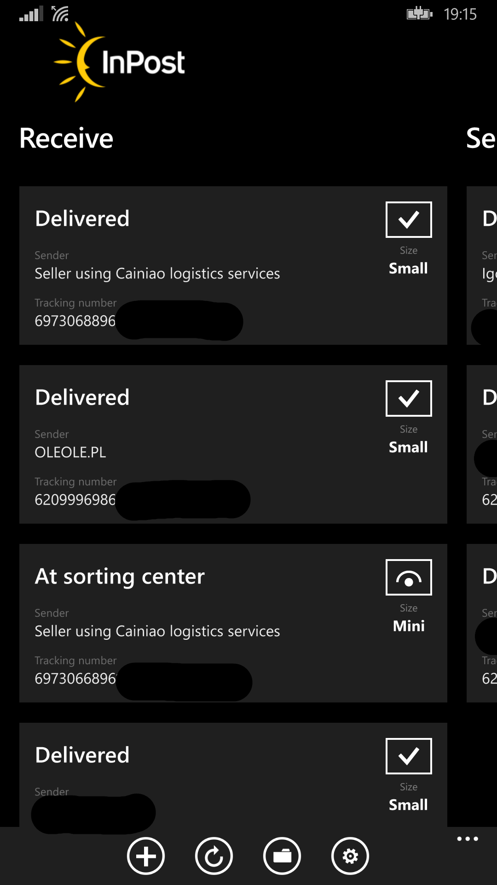
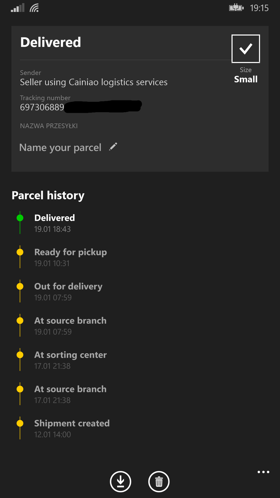

# 📦 InPost Mobile (Windows Phone 8.1)

> **Unofficial, source-available client bringing Parcel Lockers back to classic Lumia devices.**

---

## ⚠️ PROJECT IN BETA
**Please Note:** This application is currently under active development. Some features may be incomplete, and you might experience bugs. Stability is not guaranteed yet.
 UPDATED VERSION 0.9.1.2 IS NOW AVAILABLE!!
---

## 📸 Gallery

| Home Screen | Parcel Details |
|:---:|:---:|
|  |  |

---

## 🚀 About the Project

The aim of the project is to create a working application for receiving or tracking parcels from the courier company InPost, which has never released such an application on this system.

The application was created for every Windows Phone, even with 512MB of RAM.

### ✨ Key Features (Current Status)
* ✅ **Two languages ​​supported (English and Polish)
* ✅ **Parcel Tracking.
* ✅ **Logging in via phone number and adding packages assigned to it to the application.
* ✅ **Archiving packages.
* ✅ **Opening lockers using a QR code.
* ✅ **Displaying information about the parcel pickup location."
* ⚠️ **Multilocker Support**. (May cause problems when receiving the parcel)
* 🚧 **Remote Locker Opening** (I am in the process of fixing this error) 
* 🚧 **Push notifications**
* 🚧 **Live title**
* 🚧 **Dark/Light Theme** (Follows system settings).
* 🚧 *More features coming soon...*

---

## 🔒 Security & Transparency

This project is open source. You can preview the code ,edit or compile the code.

1.  **Direct Connection:** The app connects **directly** to the official InPost API. No data is routed through third-party servers.
2.  **No Tracking:** The app does not collect telemetry data or store your phone number externally.
3.  **Verify it yourself:** You can inspect the networking logic in [`ParcelManager.cs`](InPost_Mobile/Models/ParcelManager.cs) and [`LockerManager.cs`](InPost_Mobile/Models/LockerManager.cs).

---

## 🛠️ Tech Stack

* **Language:** C# (.NET 4.5)
* **Framework:** Windows Phone Silverlight 8.1
* **Communication:** HttpClient + JSON (Newtonsoft)
* **IDE:** Visual Studio 2015

---

## 📥 Installation

1.  Download the latest **Beta** `.appx` file from the **[Releases](../../releases)** section.
2.  Transfer the file to your phone.
3.  Ensure your device is **Developer Unlocked** or Interop Unlocked.
4.  Install the application using cmd injector

---

## ⚖️ License & Copyright

*✅You can modify or compile the code. But please be mindful of trademark laws.
*All trademarks (InPost, Paczkomat) belong to their respective owners and are used for informational purposes only.*
INPOST LIMITED LIABILITY COMPANY
NIP: 6793108059
REGON: 360781085
KRS: 0000543759
Registered office (main address): ul. Pana Tadeusza 4, 30-727 Kraków
Legal form: Limited liability company

---

## 📬 Contact

Have questions? Found a bug?

* **E-mail:** contact@hexryu.net
* **GitHub Issues:** [Report a bug](../../issues)
* **Discord:** hexryu